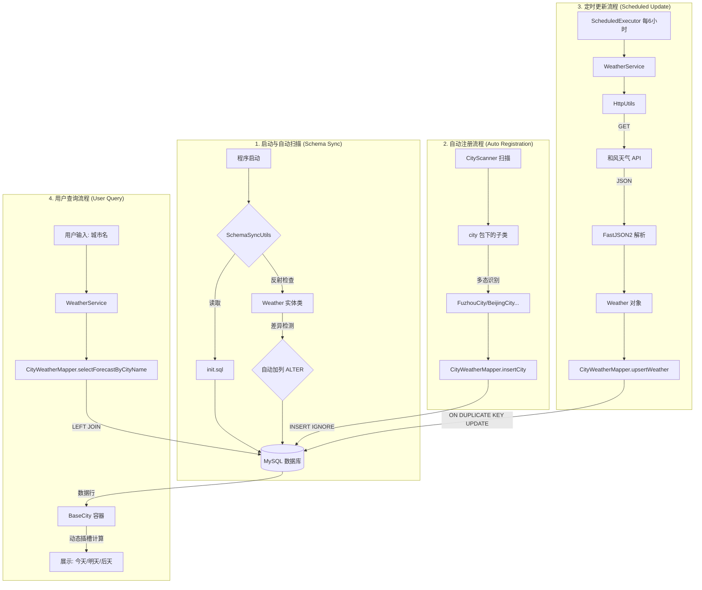

# WeatherSearch - 全自动天气搜寻与监控系统

本项目是一个基于 Java + MyBatis 的全自动天气监控系统。具备城市插槽自动注册、数据库架构自动同步、定时抓取和智能覆盖等核心功能。

## 核心功能流向图

## 系统功能模块详述

本项目的架构设计遵循“高内聚、低耦合”原则，共分为以下四个核心模块：

### 模块 1：自动初始化与架构同步 (Schema Sync)
*   **功能描述**：在程序启动的第一时间，根据配置文件自动创建表结构。其中 `SchemaSyncUtils.syncWeatherColumns()` 函数能通过反射机制自动感知 `Weather` 实体类的字段变动，若发现 Java 类中新增了属性（如 `humidity`），它会联动 `SchemaMapper` 自动在 MySQL 对应表中执行 `ALTER TABLE` 动作，无需手动修改数据库。

### 模块 2：自动城市注册 (City Slot Auto-Reg)
利用多态设计实现“插槽式”扩展。由 `CityScanner.scanCities()` 利用反射机制探测并实例化所有继承自 `BaseCity` 的具体类。获取到城市 ID 和中文名后，通过 `WeatherService.registerCitiesToDb()` 调用 `CityWeatherMapper.insertCity()` 并在 SQL 中使用 `INSERT IGNORE` 确保注册动作的幂等性。只要你在 `entity.city` 包下新建一个子类并重启，系统就会自动在数据库 `city` 表中创建对应的记录，开启监控。

### 模块 3：定时抓取与智能覆盖 (Scheduled Upsert)
由 `WeatherService.updateAllWeatherData()` 每 6 小时触发一次天气数据同步，它采用反射技术动态抓取 API 数据并将其组装为字段 Map。随后联动 `CityWeatherMapper.upsertWeather()`，利用其中的 `<foreach>` 动态生成包含 `ON DUPLICATE KEY UPDATE` 的 SQL 语句。系统能根据数据库的 **唯一约束 (city_id + fx_date)** 自动识别该条数据是该“新增”还是该“更新”，这保证了数据库中同一城市同一天永远只有一条最新的预报，实现数据的动态覆盖更新与新字段的自动同步。

### 模块 4：交互式用户查询 (Unified Query)
为用户提供简单的城市名查询接口。通过 `CityWeatherMapper.selectForecastByCityName()` 执行联表 SQL 抓取未来三天预报，将城市和天气碎片整合成一个完整的 `BaseCity` 对象。最后利用 `BaseCity.getToday()` 或 `getTomorrow()` 等方法进行内部列表比对，动态计算出对应日期的天气，规避了 Java 与 MySQL 时间对象不匹配导致的 `null` 值风险。

